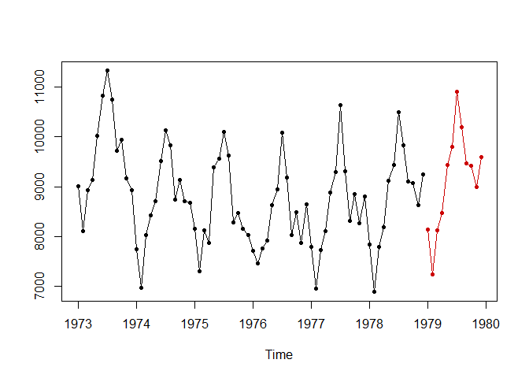

<!-- README.md is generated from README.Rmd. Please edit that file -->

# tsfgrnn

<!-- badges: start -->

[](https://github.com/franciscomartinezdelrio/tsfgrnn/actions/workflows/R-CMD-check.yaml)
<!-- badges: end -->

The goal of tsfgrnn is to forecast time series using GRNN regression.

## Installation

You can install the released version of tsfgrnn from
[CRAN](https://CRAN.R-project.org) with:

``` r
install.packages("tsfgrnn")
```

And the development version from [GitHub](https://github.com/) with:

``` r
# install.packages("devtools")
devtools::install_github("franciscomartinezdelrio/tsfgrnn")
```

## Example

This is a basic example which shows how to forecast with tsfgrnn:

``` r
library(tsfgrnn)
pred <- grnn_forecasting(USAccDeaths, h = 12)
pred$prediction # To see a time series with the forecasts
#>            Jan       Feb       Mar       Apr       May       Jun       Jul
#> 1979  8148.640  7237.667  8131.874  8466.715  9440.860  9793.261 10896.977
#>            Aug       Sep       Oct       Nov       Dec
#> 1979 10184.601  9463.049  9412.852  8985.240  9583.652
plot(pred)      # To see a plot with the forecast
```



To know more, the open access paper [Francisco Martinez et
al. (2022)](https://doi.org/10.1016/j.neucom.2021.12.028) describes the
package. Also, you can read the package’s vignette.

## Acknowledgements

Funds: This work was partially supported by the project TIN2015-68854-R
(FEDER Founds) of the Spanish Ministry of Economy and Competitiveness.
